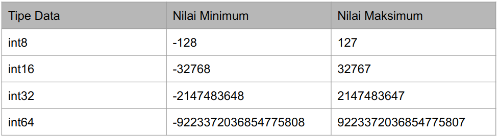

# Doc_Belajar-Golang-Dasar

### Variabel

define variabel di golang ada 2 cara menggunakan var atau :=

```
package main

import "fmt"

func main() {
	// membuat variabel menggunakan kata kunci var
	var name1 string = "Daisy"

	// membuat variabel jauh lebih mudah
	name2 := "Daisy"

	fmt.Println(name1)
	fmt.Println(name2)

}

```

### tipe data

```
string => "this is string"
int => int8, int16, int32, int64
float => float32, float64, complex64, complex128
bool => true or false
array => array := [jerry
jerry
jerry8]int{10,20,30,40}
slice => create_slice := make([]string, panjangnya berapa "2", limit nya berapa "5")
map => person := map[string]string{this data key and value misal "name" : "your name"}
struct => type Person struct{ this data }
constanta => const name string := "your name"

```
### Operasi Tipe Data String
```
package main

import "fmt"

func main() {

	// membuat variabel
	name := "Daisy "

	// fmt package import dari "fmt"
	fmt.Println(name) //result => Daisy
	//len() operasi untuk mengambil index of string. spasi tetap di hitung index
	fmt.Println(len(name)) //result => 6
}
```


###  Tipe Data Constanta
```
package main

import (
	"fmt"
)

func main() {

	// constant adalah tipe data yang tidak bisa dii ubah
	const APPNAME = "GOLANG"
	// const APPNAME = "GOLANG update" //contanta tidak dapat di ubah
	fmt.Println(APPNAME)
}

```
### MAX AND LIMIT Tipe Data int



###  Type declaration || membuat tipe data sendiri
```
package main

func main() {
	type Person string

	var name Person = "Daisy"
	var address Person = "your address"

	println(name)
	println(address)
}

```

###  Operasi pada tipe data array
```
package main

import "fmt"

func main() {

	array := [8]int{1, 2, 3, 4, 5, 6, 7, 8}
	fmt.Println(array)      //print semua array
	fmt.Println(array[0])   //mengambil array by index
	fmt.Println(len(array)) //mendapatkan panjang array

	// mengubah nilai array

	array[0] = 10
	fmt.Println(array[0]) //mengambil nilai aarray yang telah di ubah

}


```

###  Operasi pada tipe data slice
```
package main

import "fmt"

func main() {
	// membuat slice dari array

	day := [...]string{"monday", "tuesday", "wednesday", "thursday", "friday", "saturyday", "sunday"}
	// mengambil data array dan menjadikan sebagai slice nama_array[mulai dari mana : batas akhirnya  dimana]
	slice1 := day[3:5]
	fmt.Println(slice1) //result => [thursday friday]

	// mengambil dari awal dan nilai batasnya di tentukan
	slice2 := day[:3]
	fmt.Println(slice2) //result => [monday tuesday wednesday]

	// mengambil dari batas yang ditentukan dan batas akhir tidak tentukan
	slice3 := day[3:]
	fmt.Println(slice3) //result => [thursday friday saturyday sunday]

	// mengambil semua
	slice4 := day[:]
	fmt.Println(slice4)

	// mmengubah data array menggunakan slice
	slice5 := day[3:]
	slice5[0] = "thursday_update"
	slice5[1] = "friday_update"

	fmt.Println(slice5) //result => [thursday_update friday_update saturyday sunday]

	// menambahkan data di slice
	// di slice kalau kapasitasnya sudah penuh maka akan dibutkan slice yang baru
	slice6 := append(slice5, "day_ditambahkan")
	fmt.Println(slice6) //result => [thursday_update friday_update saturyday sunday day_ditambahkan]

	// slice bisa mengubah data di array tetapi kalau di tambahkan data dari array sebelumnya tidak akan muncul karena telah dibuatkan slice yang baru
	fmt.Println(day) // => [monday tuesday wednesday thursday_update friday_update saturyday sunday]

	// kata kunci make(tipe_data, panjang_slice, kapasitas dari slicenya) untuk membuat slice baru
	new_slice := make([]int, 2, 10)
	new_slice[0] = 10
	new_slice[1] = 20
	fmt.Println(new_slice) //result => [10 20]

	// melihat panjang dari slicenya
	fmt.Println(len(new_slice))

	// melihat kapasitas dari slicenya
	fmt.Println(cap(new_slice))

	// menambahkan slice
	// ERROR
	// kalau seperti ini akan error karena panjang dari slicenya sudah penuh dan harus menggunakan append
	// new_slice[2] = 30

	new_slice = append(new_slice, 30)
	fmt.Println(new_slice) // result [10 20 30]

}

```

### tipe data map di golang
```
package main

import "fmt"

func main() {

	// membuat tipe data map map([type_key] type_value)
	person := map[string]string{
		"name":    "Daisy",
		"address": "your_address",
		"country": "indonesia",
	}
	// mengambil semua data di map
	fmt.Println(person) //result => map[address:your_address country:indonesia name:Daisy]

	// mengambil salah satu data dari map menggunakan key
	fmt.Println(person["name"]) // resukt => Daisy

	// mengubah data di map
	person["name"] = "daisy_update"
	fmt.Println(person["name"]) // result => daisy_update

	// mengambil panjang data di map
	fmt.Println(len(person)) // result => 3

	// menghapus data di map menggunakan key
	delete(person, "name")
	fmt.Println(person) //result => map[address:your_address country:indonesia]

}


```

### if else expression 

```
package main

import "fmt"

func main() {
	if true {
		fmt.Println("this is true")
	} else if false {
		fmt.Println("this is false")
	} else {
		fmt.Println("unknown")
	}

}

```

### switch

```
package main

import "fmt"

func main() {

	learn_golang := true

	switch learn_golang {
	case true:
		fmt.Println("this is learn golang")
	case false:
		fmt.Println("this is not learn golang")
	default:
		fmt.Println("die")

	}

}
```

### for looping
```
package main

import "fmt"

func main() {

	// membuat perulangan dari 0 hingga 100
	// angka++ adalah increment , artinya menaikkan 1 persatu nilanya
	// angka-- adalah dicrement , artinya menurunkan 1 persatu nilainya
	// for define variabel; kondisi; increment || dicrement
	for angka := 0; angka < 100; angka++ {
		fmt.Println(angka)
	}

}

```

### for each

```
package main

import "fmt"

func main() {

	// for each atau di golang disebutnya for range adalah teknik membaca data di dalam tipe data collection seperti map, slice dan array
	data := []int{10, 20, 30, 40}

	// misal kalau menggunakan perulangan manual
	for i := 0; i < len(data); i++ {
		fmt.Println(data[i])
	}

	// ini menggunakan for range
	for keys, values := range data {
		fmt.Println(keys, "=>", values)
	}
}

```


### continue and break

```
package main

import "fmt"

func main() {

	// ini adalah break digunakan jika kondisi perulanganya sudah terpenuhi dan akan menghentikan perulangannya
	// perulangan akan terhenti jika menemui angka 8
	for i := 0; i < 100; i++ {
		if i == 8 {
			break
		}
		fmt.Println(i)
	}

	// continue adalah mengskip jika kondisinya terpenuhi dan tetap melakukan perulangan
	// mencoba mencetak angka ganjil dari 0 hingga 100
	for i := 0; i < 100; i++ {
		if i%2 != 0 {
			continue
		}
		fmt.Println(i)
	}

}

```