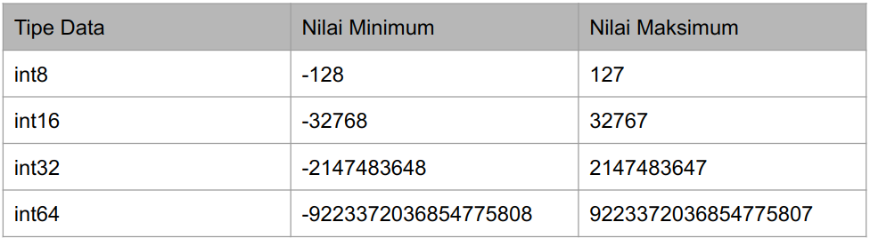

# Doc_Belajar-Golang-Dasar

### Variabel

define variabel di golang ada 2 cara menggunakan var atau :=

```
package main

import "fmt"

func main() {
	// membuat variabel menggunakan kata kunci var
	var name1 string = "Daisy"

	// membuat variabel jauh lebih mudah
	name2 := "Daisy"

	fmt.Println(name1)
	fmt.Println(name2)

}

```

### tipe data

```
string => "this is string"
int => int8, int16, int32, int64
float => float32, float64, complex64, complex128
bool => true or false
array => array := [jerry
jerry
jerry8]int{10,20,30,40}
slice => create_slice := make([]string, panjangnya berapa "2", limit nya berapa "5")
map => person := map[string]string{this data key and value misal "name" : "your name"}
struct => type Person struct{ this data }
constanta => const name string := "your name"

```
### Operasi Tipe Data String
```
package main

import "fmt"

func main() {

	// membuat variabel
	name := "Daisy "

	// fmt package import dari "fmt"
	fmt.Println(name) //result => Daisy
	//len() operasi untuk mengambil index of string. spasi tetap di hitung index
	fmt.Println(len(name)) //result => 6
}
```


###  Tipe Data Constanta
```
package main

import (
	"fmt"
)

func main() {

	// constant adalah tipe data yang tidak bisa dii ubah
	const APPNAME = "GOLANG"
	// const APPNAME = "GOLANG update" //contanta tidak dapat di ubah
	fmt.Println(APPNAME)
}

```
### MAX AND LIMIT Tipe Data int



###  Type declaration || membuat tipe data sendiri
```
package main

func main() {
	type Person string

	var name Person = "Daisy"
	var address Person = "your address"

	println(name)
	println(address)
}

```

###  Operasi pada tipe data array
```
package main

import "fmt"

func main() {

	array := [8]int{1, 2, 3, 4, 5, 6, 7, 8}
	fmt.Println(array)      //print semua array
	fmt.Println(array[0])   //mengambil array by index
	fmt.Println(len(array)) //mendapatkan panjang array

	// mengubah nilai array

	array[0] = 10
	fmt.Println(array[0]) //mengambil nilai aarray yang telah di ubah

}


```


